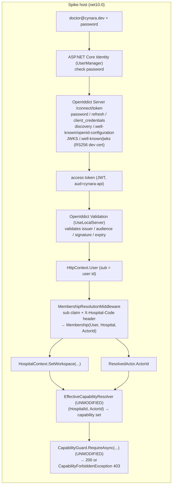
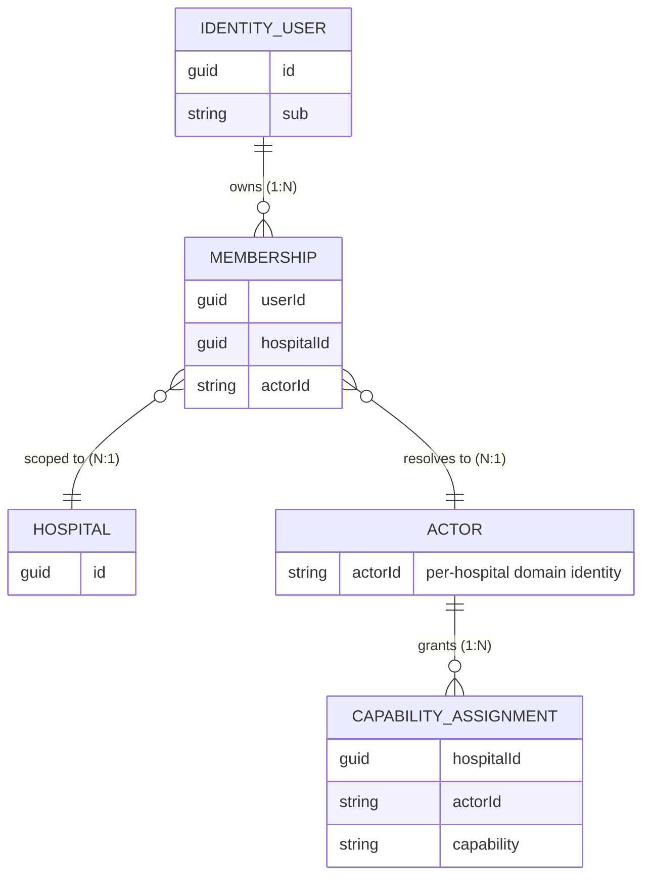

# FINDINGS — ASP.NET Core Identity + OpenIddict Spike (CYN-95)

Technical evidence and findings for the parent spike ADR
[CYN-94](https://linear.app/ailuracode/issue/CYN-94): whether ASP.NET Core
Identity + OpenIddict can coherently cover user identity, sessions, clients,
token issuance/validation, and future integrations while preserving Cynara's
capability model. This document records **what was validated in a runnable PoC**,
not a final architecture decision — the ADR decides adopt/modify/reject.

Captured: 2026-08-11. PoC location: `spikes/Cynara.IdentitySpike` (disposable,
not in `Cynara.Api.sln`; production code under `src/` untouched).

---

## 1. Purpose

Cynara API today has an authorization model keyed on actors, hospital
workspaces, and hospital-scoped capabilities, but **no user identity layer**:
`ActorId` is a free-form string from the `X-Actor-Id` request header, persisted
in `capability_assignments`, `audit_events`, and clinical rows. This spike
answers the backend half of CYN-94: can ASP.NET Core Identity (users,
credentials, account lifecycle) + OpenIddict (token server/validation,
discovery, JWKS) plug in front of that model **without changing the production
authorization architecture**, and does a multi-hospital user resolve
correctly through the existing `CurrentActor` / `HospitalContext` /
`EffectiveCapabilityResolver` / `CapabilityGuard` chain?

## 2. Architecture of the PoC



**Reused unchanged from Cynara.Application/Domain:**

| Type | Role |
|---|---|
| `HospitalContext` / `IHospitalContext` | Per-request workspace (same class production uses) |
| `EffectiveCapabilityResolver` | Memoized per-request capability resolution |
| `CapabilityGuard` | Deny-by-default domain guard |
| `ICapabilityAssignmentRepository` | Persistence port — spike implements its own against SQLite |
| `Hospital`, `CapabilityAssignment`, `CapabilityCodes` | Domain entities/constants |

**Added by the spike (nothing under `src/` changed):**

| Type | Role |
|---|---|
| `ApplicationUser` → `IdentityUser<Guid>` | Identity store |
| `Membership` | New bridge entity: UserId ↔ HospitalId ↔ ActorId |
| `PrincipalCurrentActor` | `ICurrentActor` fed by the principal + membership |
| `MembershipResolutionMiddleware` | sub + header → membership → context |
| `SpikeCapabilityAssignmentRepository` | Port implementation (SQLite) |
| `TokenController` | OpenIddict token endpoint |

## 3. User/Actor/Membership/Hospital relationship

The spike validates a four-way relationship that does not exist in the
production schema today:



Key finding: **ActorId stays a Cynara domain concept, not an Identity concept.**
Identity owns *who you are* (`sub`); Cynara owns *what you can do in which
hospital* (`(HospitalId, ActorId) → capabilities`). The same person may hold a
different actor identity in each hospital, which is exactly the existing
data model. `capability_assignments`, `audit_events`, and clinical `ActorId`/
`AuthorId` columns remain untouched and keep their current meaning.

Seeded example (the isolation demo):

| User | Hospital | ActorId | Capabilities |
|---|---|---|---|
| doctor@cynara.dev | hosp-a | doctor-alpha | patients.read, encounters.write |
| doctor@cynara.dev | hosp-b | doctor-beta | patients.read |

## 4. Token issuance/validation validated

All of the following were exercised with real HTTP requests (evidence in
section 9):

| Aspect | Result |
|---|---|
| Issuer | `iss = http://localhost:5295/` — matches configured issuer |
| Audience | `aud = cynara-api` — stamped via `SetResources` on the token handlers, registered on both server and validation sides |
| Signing keys | RS256 dev signing certificate; served at `/.well-known/jwks` with `kid` + `x5t` |
| Discovery | `/.well-known/openid-configuration` lists token/revocation endpoints, grant types (password, refresh_token, client_credentials), scopes |
| Access token lifetime | 15 minutes (`exp - iat = 900s`) |
| Refresh token lifetime | 7 days (configured) |
| Token format | Plain JWT (`typ: at+jwt`, `DisableAccessTokenEncryption`) for inspectability; production may keep encryption |
| Flows | password, refresh_token, client_credentials all issued tokens |
| Revocation | `/connect/revocation` returns 200; reusing the revoked refresh token fails with `invalid_grant` |
| Validation | `AddValidation().UseLocalServer()` validated issuer, audience, signature, and expiry before endpoints ran |

First-party API vs external clients: the confidential client
(`cynara-spike`) proves the first-party path; the client credentials grant
demonstrates how a future external/MCP service client would obtain a token
(`sub` = client id). Password flow is used only for the PoC — the parent spike
should weigh authorization-code+PKCE for the Web client (see section 10).

## 5. Integration with the existing authorization model

The critical validation: **the Application layer was not modified and did not
need to be.** The spike only swapped the *source* of `ICurrentActor.ActorId`
(from the `X-Actor-Id` header to the authenticated principal + membership) and
provided a spike implementation of the persistence port. Everything downstream
(`HospitalContext`, `EffectiveCapabilityResolver`, `CapabilityGuard`, the
`CapabilityForbiddenException` → 403 mapping) ran as-is.

- Hospital selection still comes from the `X-Hospital-Code` header — the
  production tenant-selection pattern is preserved.
- The `X-Actor-Id` header is gone in the spike; actor identity is derived from
  `sub` + membership, so a client can no longer impersonate an arbitrary actor
  string. This is the main security improvement the spike demonstrates.
- `ICurrentActor` null (service token, no membership) resolves to the empty
  capability set — deny by default, identical to production behavior.

## 6. Hospital isolation demonstrated

One access token, two hospital headers, two distinct actors and capability
sets (section 9, steps 6–9):

- `GET /api/me` + `X-Hospital-Code: hosp-a` → actor `doctor-alpha`,
  capabilities `[encounters.write, patients.read]`.
- `GET /api/me` + `X-Hospital-Code: hosp-b` → actor `doctor-beta`,
  capabilities `[patients.read]`.
- `GET /api/encounters` + hosp-a → **200**; + hosp-b → **403**
  (`Capability required`, Problem Details envelope).
- `GET /api/patients` + hosp-b → **200**.

Why it is structurally safe: `EffectiveCapabilityResolver` filters every
lookup by `HospitalId` from the request context, and the membership lookup is
scoped by `(UserId, HospitalCode)`. An actor from hospital A can never resolve
capabilities in hospital B because the resolver never sees a B assignment for
the A actor id. No cross-tenant query path exists in the spike (mirrors the
production repository contract).

## 7. Migration implications

If the ADR adopts this stack, production changes include:

- **New tables (Identity):** `AspNetUsers`, `AspNetRoles`, `AspNetUserRoles`,
  `AspNetUserClaims`, `AspNetUserLogins`, `AspNetUserTokens`
  (`AddIdentity().AddEntityFrameworkStores()`).
- **New tables (OpenIddict):** `OpenIddictApplications`,
  `OpenIddictAuthorizations`, `OpenIddictScopes`, `OpenIddictTokens`.
- **New table (domain):** `memberships` (UserId, HospitalId, ActorId) with a
  unique index on `(UserId, HospitalId)`.
- **Existing tables reused as-is:** `hospitals`, `capability_assignments`
  (no schema change).
- **Provider:** production uses Npgsql via the existing
  `AddCynaraDatabase` path; the spike used SQLite only for disposability.
  Migrations would be added with the repo's `dotnet-ef 10.0.10`
  (`dotnet ef migrations add AddIdentityOpenIddict --project src/Cynara.Infrastructure`),
  following the existing migration flow in `InitializeDatabaseAsync`.
- OpenIddict EF stores: `options.UseEntityFrameworkCore()
  .UseDbContext<...>()` registers the four store types; `UseOpenIddict()`
  on the DbContext options adds the entity sets.

## 8. Persistence / deployment / operational implications

- **Signing/encryption keys:** the spike uses `AddDevelopmentSigningCertificate`
  / `AddDevelopmentEncryptionCertificate` (stable across runs, stored in the
  local machine cert store). Production must provision real certificates or
  keys (Azure Key Vault / KMS / mounted certs) and define a rotation policy;
  OpenIddict supports multiple credentials (`AddSigningCertificate(...)` /
  `AddSigningKey(...)`) so rotation = add new, keep old until tokens expire.
  If access-token encryption is kept, the encryption credential must be shared
  with the API validation side or use local-server validation in a monolith.
- **Issuer behind a proxy:** the issuer must match the public URL clients see;
  the repo already has `AddCynaraForwardedHeaders`, which is the right place
  to keep scheme/host correct when OpenIddict validates host headers.
- **Secrets:** client secrets and any signing material belong in the secrets
  store, never in source. The spike's `spike-secret` is a dev-only value.
- **Token lifecycle:** access 15m, refresh 7d, revocation endpoint available;
  refresh tokens are rolling by default and stored (revocable) in
  `OpenIddictTokens`. Logout semantics for the Web client need an
  end-session/revocation design in the Web spike.
- **Data protection:** if encrypted tokens are used, `IDataProtectionProvider`
  keys must be consistent across instances (persisted key ring).
- **Multi-instance:** Identity + OpenIddict EF stores are shared-DB friendly;
  no in-memory state except the dev cert (which must become a real provisioned
  credential in production).
- **Auditability:** Cynara's `IAuditWriter`/`audit_events` stay untouched;
  Identity adds its own security-event surface (`SecurityStamp`,
  `AccessFailedCount`, lockout). Decide later whether authentication events
  should also flow into `audit_events`.
- **Operational maturity:** password hashing, lockout, and account lifecycle
  are provided by Identity out of the box; passkeys/MFA/external logins are
  extensions on the same model (not validated in this backend spike).

## 9. Evidence (captured 2026-08-11)

All commands ran against the spike host at `http://localhost:5295` with a
fresh seed.

### 9.1 Discovery

```
GET /.well-known/openid-configuration → 200
{
  "issuer": "http://localhost:5295/",
  "token_endpoint": "http://localhost:5295/connect/token",
  "revocation_endpoint": "http://localhost:5295/connect/revocation",
  "jwks_uri": "http://localhost:5295/.well-known/jwks",
  "grant_types_supported": ["password", "refresh_token", "client_credentials"],
  "scopes_supported": ["openid", "offline_access", "profile", "email", "cynara_api"],
  "id_token_signing_alg_values_supported": ["RS256"],
  "subject_types_supported": ["public"]
}
```

### 9.2 JWKS

```
GET /.well-known/jwks → 200
key: kid DAE5AB27D802CCB67DB9506385B4939C429B0BCA | alg RS256 | kty RSA | use sig
```

### 9.3 Password grant → access token

```
POST /connect/token (password, doctor@cynara.dev, scope=openid profile email offline_access cynara_api) → 200
token_type: Bearer
expires_in: 899
scope: profile email offline_access cynara_api
has refresh_token: true
```

Decoded access token payload:

```
aud: cynara-api
client_id: cynara-spike
email: doctor@cynara.dev
exp: 1786462010
iat: 1786461110
iss: http://localhost:5295/
jti: 1c4dc25d-6f87-4c21-b9ad-d8b5835cb60b
name: doctor@cynara.dev
scope: profile email offline_access cynara_api
sub: 74d5f37b-6c06-4630-9613-a0e5c63583c1
```

### 9.4 Multi-hospital isolation (same token)

```
GET /api/me  X-Hospital-Code: hosp-a → 200
{"userId":"...","email":"doctor@cynara.dev",
 "hospital":{"id":"...","code":"hosp-a","name":"Hospital Alpha"},
 "actorId":"doctor-alpha",
 "capabilities":["encounters.write","patients.read"]}

GET /api/me  X-Hospital-Code: hosp-b → 200
{"userId":"...","email":"doctor@cynara.dev",
 "hospital":{"id":"...","code":"hosp-b","name":"Hospital Beta"},
 "actorId":"doctor-beta",
 "capabilities":["patients.read"]}
```

### 9.5 Capability guard (200 vs 403)

```
GET /api/encounters  X-Hospital-Code: hosp-a → 200
{"message":"encounters.write granted","actorId":"doctor-alpha","hospitalCode":"hosp-a"}

GET /api/encounters  X-Hospital-Code: hosp-b → 403
{"type":"https://tools.ietf.org/html/rfc9110#section-15.5.4",
 "title":"Capability required","status":403,
 "detail":"Capability 'encounters.write' is required.","actorId":"doctor-beta"}

GET /api/patients  X-Hospital-Code: hosp-b → 200
{"message":"patients.read granted","actorId":"doctor-beta","hospitalCode":"hosp-b"}
```

### 9.6 Refresh token

```
POST /connect/token (refresh_token) → 200
new access_token + new refresh_token emitted, scope preserved (profile email offline_access cynara_api)
```

### 9.7 Revocation

```
POST /connect/revocation (refresh_token + client auth) → 200
POST /connect/token (same refresh_token) → 400
{"error":"invalid_grant","error_description":"The specified refresh token is no longer valid."}
```

### 9.8 Negative cases

```
GET /api/me (no token) → 401
POST /connect/token (wrong password) → 400
{"error":"invalid_grant","error_description":"Invalid credentials."}
```

### 9.9 Client credentials (external/service client)

```
POST /connect/token (client_credentials, scope=cynara_api) → 200
decoded: sub=cynara-spike, aud=cynara-api, scope=cynara_api, client_id=cynara-spike

GET /api/me with service token → 200 (empty context)
{"userId":"cynara-spike","email":null,"hospital":null,"actorId":null,"capabilities":[]}
```

The service token has no membership → hospital/actor/capabilities resolve to
nothing (deny by default), which is the correct first-party/external-client
behavior to preserve.

## 10. Findings and risks for the ADR

1. **Integration is clean and low-risk.** The Application-layer authorization
   model (actor + hospital + capability) works unchanged behind an
   Identity/OpenIddict principal. The only production change needed is the
   `ICurrentActor` source and a membership lookup; no capability semantics
   change.
2. **ActorId must remain a Cynara domain identity.** Deriving capabilities
   directly from Identity claims would couple token lifetime to authorization
   state. Keeping `ActorId` as a per-hospital domain string (resolved from
   `sub` + membership at request time) preserves today's data model and lets
   membership changes take effect immediately without token re-issuance.
3. **Membership lifecycle needs a product decision.** Who creates/revokes
   memberships, and where (API surface, seeding, admin)? The spike only
   demonstrates the resolution path. The parent spike should decide whether
   membership is a hospital-admin domain operation (likely yes) and how it
   relates to user provisioning (Identity `UserManager`).
4. **Hospital switch UX is a Web-side decision.** The spike keeps
   `X-Hospital-Code` as the selector. Options for the Web spike: header per
   request (current), a `hospital` claim in the token, or a workspace-switch
   endpoint. Each has trade-offs on token staleness vs. request simplicity.
5. **Password flow is PoC-only.** ROPC exposes credentials to the client and
   is not recommended for production; the Web spike should validate
   authorization-code + PKCE. For first-party API/MCP, client credentials +
   scopes is the right shape and already works (9.9).
6. **Stage 4 MCP compatibility.** The client credentials grant plus a scoped
   audience (`cynara-api`) gives a concrete mechanism for MCP service
   authentication. MCP-specific scopes/claims should not be finalized now, but
   the architecture does not block them.
7. **Key management is the main operational cost.** Dev certs are trivial;
   production requires real signing/encryption credentials, rotation, and
   consistent Data Protection keys across instances. This is standard OIDC
   ops overhead, not OpenIddict-specific.
8. **Migration surface is additive.** Identity + OpenIddict + `memberships`
   are new tables; `hospitals` and `capability_assignments` are unchanged.
   No destructive migration.
9. **Comparison inputs (objective, not a decision):** vs. external OIDC
   provider — external wins on managed key rotation/MFA/passkeys but adds a
   network dependency and tenant-consent surface; vs. Keycloak — richer admin
   UI and federation, heavier deployment; vs. Better Auth — JS-first, less
   natural for a .NET API; Identity+OpenIddict keeps everything in-process and
   reuses the existing .NET/EF investment, at the cost of operating the OIDC
   server yourself. The ADR weighs these against Cynara's ops capacity.
10. **Non-goals respected.** No production auth replaced, no RBAC introduced,
    no MCP server built, no final identity architecture chosen. `git status`
    shows only new files under `spikes/` plus one `.editorconfig` suppression
    for the disposable spike area.

## 11. Repro steps

```bash
cd cynara-api
dotnet run --project spikes/Cynara.IdentitySpike
# host: http://localhost:5295, DB reset+seeded on startup
# see README.md for the curl cheat sheet
```

The spike builds warning-free with the repo's strict analyzers
(`dotnet build spikes/Cynara.IdentitySpike/Cynara.IdentitySpike.csproj`),
is not part of `Cynara.Api.sln`, and can be deleted after the ADR without
touching production code.
